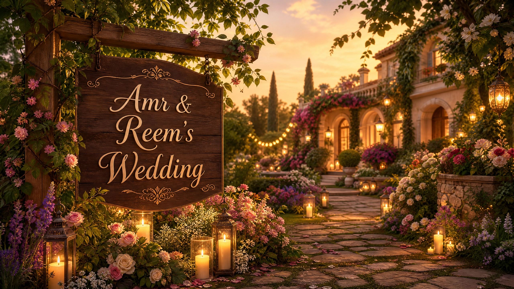

<!DOCTYPE html>
<html lang="ar" dir="rtl">
<head>
    <meta charset="UTF-8">
    <meta name="viewport" content="width=device-width, initial-scale=1.0">
    <title>دعوة زفاف عمرو وريم</title>
    <link rel="preconnect" href="https://fonts.googleapis.com">
    <link rel="preconnect" href="https://fonts.gstatic.com" crossorigin>
    <link href="https://fonts.googleapis.com/css2?family=Cairo:wght@300;400;700&family=Tajawal:wght@300;500;700&display=swap" rel="stylesheet">
    
</head>
<body>

    

        <h1>عمرو & ريم</h1>
        
يسعدنا دعوتكم لمشاركتنا فرحتنا

        
25 يوليو 2026

    

    

        
🎵 الموسيقى الخلفية

        <audio autoplay loop controls id="bgMusic">
            <source src="Swany.mp3" type="audio/mpeg">
            متصفحك لا يدعم تشغيل الصوت.
        </audio>
    

    <h2 style="color: var(--accent-color);">العد التنازلي لليوم المنتظر 🤍</h2>
    

        
00<label>أيام</label>

        
00<label>ساعات</label>

        
00<label>دقائق</label>

    

    

        <h2 style="color: var(--accent-color); margin-bottom: 30px;">حكايتنا ✨</h2>
        
        

            
            

                <h3>الفصل الأول: البداية</h3>
                
تفاصيل القصة الأولى والترتيبات الجميلة...

            

        

        

            
            

                <h3>الفصل الثاني: التفاصيل</h3>
                
حكاية التخطيط والخطوات اللي مشيناها سوا...

            

        

        

            
            

                <h3>الفصل الثالث: يوم الخطوبة</h3>
                
ذكريات اليوم اللي جمعنا وبداية الحلم الكبير...

            

        

        

            
            

                <h3>الفصل الرابع: فرحتنا الكبيرة</h3>
                
تجهيز مكاننا وفرحتنا الكبيرة اللي بتكمل بيكم في الفيلا...

            

        

    

    

        <h3>تفاصيل حفل الزفاف</h3>
        
📍 <strong>المكان:</strong> Villa Bashari, Giza

        
⏰ <strong>الوقت:</strong> الساعة 6:00 مساءً

    

    

        <h3>هل ستشاركونا الفرحة؟</h3>
        
نرجو تأكيد حضوركم عبر الرابط التالي:

        <a href="https://forms.google.com" target="_blank" class="btn">تأكيد الحضور (RSVP)</a>
    

    
صنع بحب لـ عمرو & ريم 🤍

    
</body>
</html>
